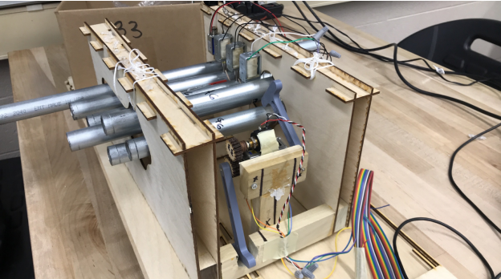
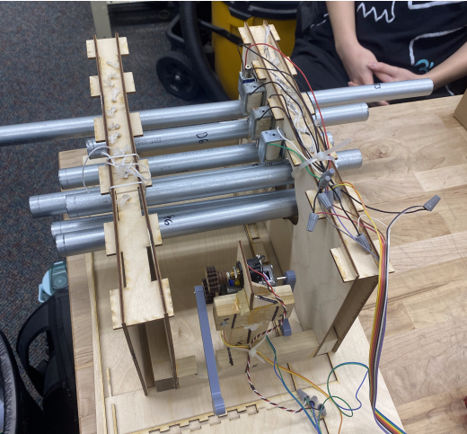

## Problem

RIT team design project ("robochime"): build a device that autonomously plays a song at least 40 seconds long, using at least 5 different notes, triggered by a single flip of a power switch with no further human interference. Built from a provided kit of parts, judged on sound quality rather than a fixed spec.

## Constraints

- Must use, and activate, at least one motor and at least one solenoid to help play the song
- Kit-parts only (plus a reasonable amount of hot glue); paint allowed but decorative only, never load-bearing
- Must rest solely on a table's top surface (no clamping/adhering, though it can extend below the table edge) and fit inside a 23"W x 19"D x 19.5"H box; all wiring to the shared control box goes through a provided 26-pin ribbon header

## Design decisions

- Chose a stationary mounting layout (the team called it "Upside Down") where the chimes hang on their sides against a fixed wall and the solenoids never move, over three rival concepts that moved the striker instead: a spinning turntable, a conveyor-belt striker, and a multi-arm pendulum ("Patrick Star"). Two Pugh charts, scored against a rotated datum, favored it on shortest impulse time, fewest moving parts, and holding each chime in a resonating position; it also meant one dead solenoid wouldn't take down the whole song, unlike a shared-striker design. The tradeoff: it needs one solenoid per note instead of reusing a smaller number across notes.
- Arduino control was built up from three isolated timing tests (sequential on/off, a counted 10-blink test, and a staggered simultaneous-activation test on a physical LED test box) before being combined into the final playback sequence, so each note's timing was verified against real hardware rather than trusted from code alone. The drive motor's published stall torque (3.53 mN·m) and no-load speed (12,250 rpm) were checked against the mechanism's expected load to confirm it wouldn't stall mid-song.
- The Onshape frame went through several rounds of simplification once building started, each driven by what testing revealed rather than the original CAD: bottom-cut supports replaced routed ones (no access to a routing machine), single-panel walls replaced double-panel walls once one panel proved strong enough, slotted joints replaced laser-cut finger joints (the finger joints were hard to assemble and flimsy), and side panels were dropped entirely once the frame proved it didn't need them.

## Analysis and validation

Three of the seven tube resonators were measured with a microphone and Audacity and compared against the frequency predicted by the pipe-length model (steel density and Young's modulus sourced from a statics reference and aqua-calc.com). Measured frequencies landed 1.36%, 0.24%, and 0.056% off prediction — all well inside the team's ±2% tolerance — so no pipe needed re-cutting or tuning by ear.

## Outcome

The finished device autonomously played its song on a single switch flip, meeting the brief's core requirement. Getting there took several rounds of build-driven redesign rather than a single clean build: the frame was repeatedly simplified once fabrication access and joint strength issues showed up (routed supports to bottom-cut, double-panel to single-panel walls, finger joints to slotted joints, side panels dropped), and Arduino timing was proven on isolated hardware tests before being trusted in the final sequence. The frequency-validation results gave confidence the tube-length model was accurate enough to use again without needing empirical tuning.
